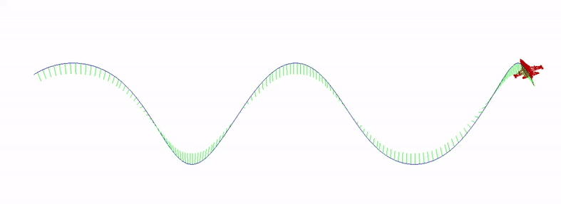

# RG-FER-2021

Laboratory exercises for course Computer Graphics at Faculty of Electrical Engineering and Computing, University of Zagreb.

 

# Lab1 - B-spline

Model of an F-16 aircraft travels along a B-spline determined by a set of control points.

 

 

# Lab2 - Particle system

 

# Lab3 - Numerical integration visualization [[link](https://github.com/LMesaric/ODE-Explorer)]

